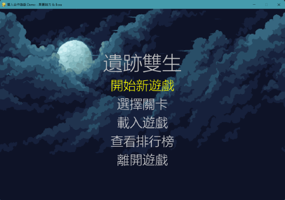
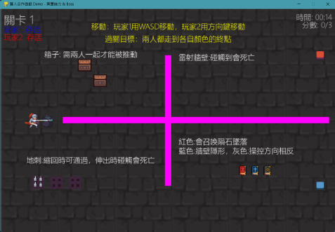
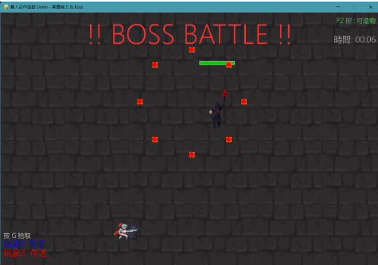
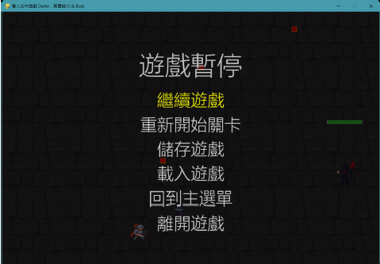
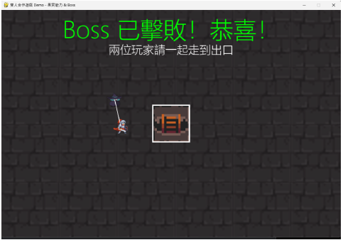
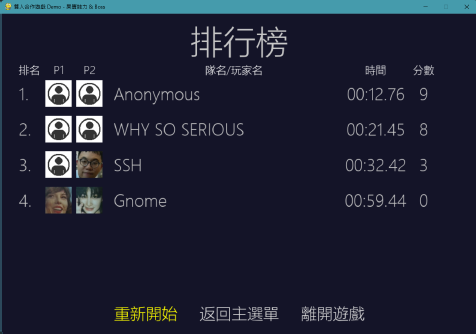

# 遺跡雙生 (Relic Twins)

**《遺跡雙生》** 是一款基於 Python 與 Pygame 開發的雙人本地合作解謎與動作遊戲。玩家將分別扮演兩名角色，在充滿機關與陷阱的遺跡中探索，利用各自的「異質能力」互相配合，解開謎題並合作戰勝強大的 Boss！

## 遊戲特色

### 遊戲畫面展示

| 起始畫面 | 迷宮關卡 |
|:---:|:---:|
|  |  |

| Boss關卡 | 遊戲暫停畫面 |
|:---:|:---:|
|  |  |

| 擊敗畫面 | 排行榜 |
|:---:|:---:|
|  |  |

* **豐富的關卡挑戰**：遊戲中包含 3 個經過精心設計的解謎關卡，以及 1 個挑戰極限的終極 Boss 關卡。
* **雙人合作解謎**：兩位玩家需要形影不離，共同推動沉重的箱子、抓準時機穿過致命的紅外線雷射牆與地刺陷阱。
* **異質能力系統 (魔法書)**：玩家可以拾取不同顏色的魔法書來獲得特殊能力，在關卡與 Boss 戰中發揮關鍵作用：
  * 🟥 **紅色魔法書**：能夠召喚隕石墜落，對敵人造成巨大的範圍傷害。
  * 🟦 **藍色魔法書**：可以使隱形的牆壁顯形，幫助找到隱藏的道路。
  * ⬜ **灰色魔法書**：具有操控方向相反的特殊效果，用於應對特定的機關或干擾敵人。
* **史詩級 Boss 戰**：充滿挑戰性的彈幕射擊與機制考驗，考驗兩人的默契與反應能力。
* **存檔與排行榜系統**：
  * 支持隨時隨地的「儲存遊戲」與「載入遊戲」(`savegame.json`)。
  * 挑戰最速通關！完成遊戲後可以將您的隊名/玩家名紀錄在本地「排行榜」上 (`leaderboard.json`)，爭奪最佳的通關時間與分數。
* **完整的 UI 與提示系統**：主選單、暫停選單、關卡選擇頁面，以及遊戲內提供即時操作提示圖文。

## 基礎操作

本遊戲為單機雙人合作（Local Co-op），請兩位玩家使用同一個鍵盤進行遊玩：


| 動作         | 玩家 1 (玩家一) | 玩家 2 (玩家二)                                        |
| :----------- | :-------------- | :----------------------------------------------------- |
| **移動**     | `W` `A` `S` `D` | `↑` `↓` `←` `→` (方向鍵)                           |
| **拾取物品** | `G` 鍵          | （視遊戲提示而定，通常靠近即可觸發或同樣依賴特定按鍵） |

> **過關目標**：兩人必須同時走到各自顏色的終點處（例如藍色玩家到藍方塊，紅色玩家到紅方塊）才可進入下一關。

## 安裝與執行說明

### 系統需求

* Python 3.8 或以上版本
* Pygame 2.x
* OpenCV (opencv-python)

### 步驟

1. **克隆/下載本專案**至您的電腦中。
2. **安裝依賴套件**：打開終端機 (Terminal) 或命令提示字元 (CMD)，輸入以下指令安裝所需套件：
   ```bash
   pip install pygame opencv-python
   ```
3. **啟動遊戲**：在專案主目錄下，執行 `main.py`：
   ```bash
   python main.py
   ```

## 專案結構

* `main.py`: 遊戲主程式與核心邏輯，啟動遊戲請執行此檔案。
* `player.py`: 定義玩家物件、移動、物理碰撞與控制。
* `animations.py` / `drawing.py`: 負責遊戲內的美術資源加載、精靈動畫播放與渲染繪製。
* `boss_entities.py`: Boss 戰的 AI 邏輯、技能施放與彈幕軌跡計算。
* `music.py`: 處理遊戲背景音樂與音效的播放。
* `savegame.json` / `leaderboard.json`: 儲存遊戲進度與排行榜數據。
* `docs/images/`: 存放專案文件的螢幕截圖與展示圖片。
* `game_music/` / `plays_animation_art/` / `CatchFace/`: 遊戲的美術與音樂音效等靜態資源。

## 授權與宣告

本專案為開發 Demo 版本，請勿將其用於商業用途。所有美術與音樂資源均為專案範圍內使用，版權歸原作者所有。
